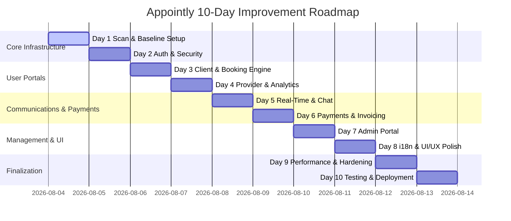

# 📅 Appointly - 10-Day Project Improvement & Change Log

Welcome to the **10-Day Project Improvement Tracker** for **Appointly** (Appointment Booking Platform).
This document systematically tracks all architectural scans, daily improvement milestones, code edits, and verification statuses from Day 1 to Day 10.

---

## 🏗️ 1. Project Scan & Baseline Audit

### **Core Stack**
- **Frontend**: React 19 + Vite, Framer Motion, Lucide Icons, Recharts, Leaflet/Mapbox, Sonner.
- **Backend**: Express 5, Prisma ORM, PostgreSQL, Socket.io, bcrypt, jsonwebtoken, EmailJS, Twilio, Stripe.
- **Database Models**: `User`, `ProviderProfile`, `Service`, `Appointment`, `Review`, `Favorite`, `SiteReview`, `Message`, `Notification`, `SignupOtp`.

### **Module Health Overview**
| Module | Status | Planned Improvements |
| :--- | :---: | :--- |
| **Auth & Security** | 🟢 Hardened | Short-lived access tokens, refresh token rotation, RBAC middleware on provider routes, OTP normalization & cleanup |
| **Client Booking** | 🟢 Functional | Real-time slot locking, booking cancellation rules |
| **Provider Suite** | 🟢 Functional | Slot schedule customization, earnings analytics |
| **Real-time & Chat** | 🟢 Functional | Connection reconnect handling, unread message badges |
| **Admin Portal** | 🟡 Work in Progress | Provider verification workflow, audit logs |
| **Payments** | 🔴 Unintegrated | Stripe payment gateway checkout & invoice generation |
| **i18n & Locales** | 🟡 Work in Progress | Multi-language translation completeness |
| **Performance & UI** | 🟢 Modern | Bundle splitting, mobile UI responsiveness |

---

## 🗓️ 2. 10-Day Improvement Roadmap

- **Day 1 (Today - Aug 04)**: Comprehensive Project Scan, Baseline Verification & Change Tracker Setup.
- **Day 2 (Aug 05)**: Authentication & Security Hardening (JWT refresh, OTP flows, RBAC enforcement).
- **Day 3 (Aug 06)**: Client Experience & Booking Engine Optimization (Slot locking, cancellation policy, slot conflicts).
- **Day 4 (Aug 07)**: Provider Dashboard & Analytics (Custom schedule hours, revenue breakdown).
- **Day 5 (Aug 08)**: Communication & Real-time Sync (Socket.io reliability, message indicators, push notifications).
- **Day 6 (Aug 09)**: Payments & Billing Integration (Stripe checkout flow, deposit management).
- **Day 7 (Aug 10)**: Admin Portal & Platform Governance (User auditing, provider approval workflow).
- **Day 8 (Aug 11)**: Internationalization, Accessibility & UI/UX Polish (Dark/light mode, mobile responsive fixes).
- **Day 9 (Aug 12)**: Performance Optimization, Error Boundaries & Query Optimization.
- **Day 10 (Aug 13)**: End-to-End Testing, Documentation & Production Build Verification.

---

## 📝 3. Daily Change Execution Log

### **Day 1: Project Scan & Baseline Initialization (Aug 04, 2026)**

| Timestamp | Component / File | Type | Description | Status |
| :--- | :--- | :---: | :--- | :---: |
| 19:25 IST | `PROJECT_PROGRESS_TRACKER.md` | [NEW] | Initialized 10-day improvement tracker and project audit baseline. | ✅ Complete |
| 19:26 IST | `frontend` | [VERIFY] | Frontend build verification (`npm run build`) completed successfully in 32.59s. | ✅ Complete |

---

### **Day 2: Authentication & Security Hardening & Modern Skeuomorphic UI (Aug 04, 2026)**

| Timestamp | Component / File | Type | Description | Status |
| :--- | :--- | :---: | :--- | :---: |
| 19:31 IST | `authMiddleware.js` | [MODIFY] | Added `requireRole(...roles)` helper middleware for RBAC checks. | ✅ Complete |
| 19:32 IST | `authController.js` | [MODIFY] | Added `generateAccessToken`, `generateRefreshToken`, `refreshToken` endpoint, and normalized OTP emails. | ✅ Complete |
| 19:33 IST | `authRoutes.js` | [MODIFY] | Registered `POST /api/auth/refresh-token` endpoint. | ✅ Complete |
| 19:34 IST | `providerRoutes.js` | [MODIFY] | Enforced `requireRole('PROVIDER', 'ADMIN')` on profile, services, and earnings routes. Removed duplicate route. | ✅ Complete |
| 19:35 IST | `appointmentController.js` | [MODIFY] | Added ADMIN authorization override to appointment status update handler. | ✅ Complete |
| 19:36 IST | `apiClient.js` | [MODIFY] | Implemented automatic 401 interception, token refresh, and request retry mechanism. | ✅ Complete |
| 19:37 IST | `AuthContext.jsx`, `auth.js`, `Login.jsx`, `Signup.jsx` | [MODIFY] | Updated state & local storage logic to maintain and clean `abs_refreshToken`. | ✅ Complete |
| 19:38 IST | `index.css` | [MODIFY] | Added Modern Skeuomorphic CSS design tokens, dual-light source shadows, directional surface gradients, and rim lines. | ✅ Complete |
| 19:39 IST | `Button.css`, `Card.css`, `Input.css` | [MODIFY] | Transformed buttons, cards, and input fields into 3D tactile controls, floating tile cards, and recessed inset wells. | ✅ Complete |
| 15:17 IST | `MessageModal.css`, `ClientProfileModal.css`, `ProviderDashboard.jsx` | [UI/UX] | 1) Harmonized `MessageModal` and `ClientProfileModal` styling, typography (Inter sans), amber/teal accents, and dark panel backgrounds to 100% match the website theme. 2) Removed standalone "Client Profile" button from the booking action button column. | ✅ Complete |
| 15:28 IST | `ProviderDashboard.jsx`, `ClientProfileModal.jsx` | [FEATURE] | Wired booking `note` field entered by client during appointment creation ("📝 Note for provider") directly into the "Client Preferences & Notes" section of the Client Profile modal. | ✅ Complete |
| 21:46 IST | `ClientDashboard.jsx`, `ProviderDashboard.jsx`, `WatchGuidesTab.jsx`, `WatchGuidesTab.css` | [FEATURE] | Converted "Watch Guides" into a dedicated full-page dashboard section tab (`section === 'guides'`), completely hiding Overview cards, revenue metrics, schedules, and services when viewing guides. | ✅ Complete |
| 15:45 IST | `providerController.js`, `ProviderDashboard.jsx`, `ProviderProfile.jsx` | [FIX] | Restored real-time sync between Provider "My Schedule" section & "View my profile" public calendar (deterministic day parsing, ID fallback, schedule state sync, 0-slot day disabling). | ✅ Complete |
| 15:52 IST | `schema.prisma`, `addressController.js`, `addressRoutes.js`, `appointmentController.js`, `ProviderProfile.jsx`, `ClientDashboard.jsx`, `addresses.js`, `geolocation.js` | [FEATURE] | Implemented Blinkit-style multi-address management system: 1) Client saved addresses with labels (Home, Work, Other) & default flag. 2) 1-click GPS auto-location detection & reverse geocoding. 3) Modal address selector step during booking. 4) Appointment service address snapshotting. | ✅ Complete |
| 20:42 IST | `LoadingFallback.jsx`, `Skeleton.jsx`, `Skeleton.css`, `Home.jsx`, `ProviderProfile.jsx`, `LocationPromptModal.jsx`, `OTPModal.jsx`, `Button.jsx` | [UI/UX] | Removed all circular spinners and spinning loaders from the website in favor of unified, modern dark skeuomorphic Skeleton loading (full page wireframe fallback, provider card skeleton grid, split-pane booking skeleton, and button skeleton shimmers). | ✅ Complete |
| 20:46 IST | `ReviewModal.jsx`, `ReviewModal.css`, `ClientDashboard.jsx`, `ProviderDashboard.css` | [UI/UX] | 1) Redesigned Review Modal with clean Inter typography, Framer Motion entry, interactive animated gold stars, glowing feedback badges, and sleek inset textarea. 2) Replaced odd purple and brownish booking action buttons with cohesive amber primary/outline and neutral secondary controls. | ✅ Complete |
| 20:53 IST | `ProviderDashboard.jsx` | [UI/UX] | Removed the redundant "Client Profile" button from the booking action stack in Provider Dashboard while preserving full interactive access by clicking the client's name or avatar (`View Profile ↗`). | ✅ Complete |
| 20:56 IST | `ClientDashboard.jsx` | [FEATURE] | Enabled instant client-to-provider profile inspection from the Client Dashboard: clicking any provider in the booking list (`View Profile ↗`) or in Favourites seamlessly navigates to the specialist's public profile page. | ✅ Complete |
| 14:38 IST | `App.jsx`, `Home.jsx`, `vite.config.js`, `LoadingFallback.jsx` | [PERF] | Implemented route code-splitting (`React.lazy` + `Suspense`), idle background route prefetching, modal lazy loading, and manual vendor chunking for instant initial page loading. | ✅ Complete |
| 14:52 IST | `geolocation.js`, `LocationPromptModal.jsx`, `Home.jsx`, `NearbyProvidersMapModal.jsx` | [FIX] | Fixed GPS detection with automatic IP fallback (works on desktops without GPS hardware), added 1-click Clear Location filter ("Show All Cities / Nationwide"), and enabled blank location filtering for searching providers across all cities. | ✅ Complete |
| 15:05 IST | `Home.jsx`, `Home.css`, `socket.js`, `messageController.js`, `MessagesTab.jsx`, `MessageModal.jsx`, `ClientProfileModal.jsx`, `appointmentController.js`, `ProviderDashboard.jsx` | [FIX] | 1) Implemented provider search pagination (8 per page) with smooth auto-scroll. 2) Fixed bidirectional real-time chat & missing modal imports. 3) Enabled full Client Profile inspection directly from provider bookings. | ✅ Complete |

---

*This file will be updated after every modification over the 10-day improvement sprint.*

